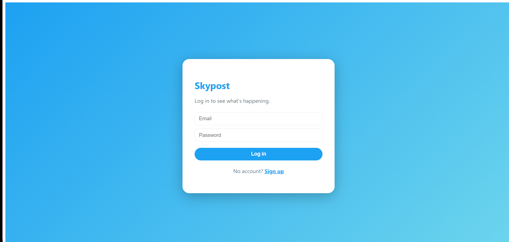
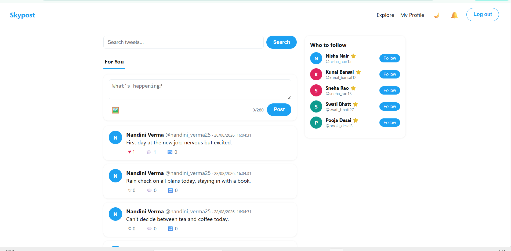
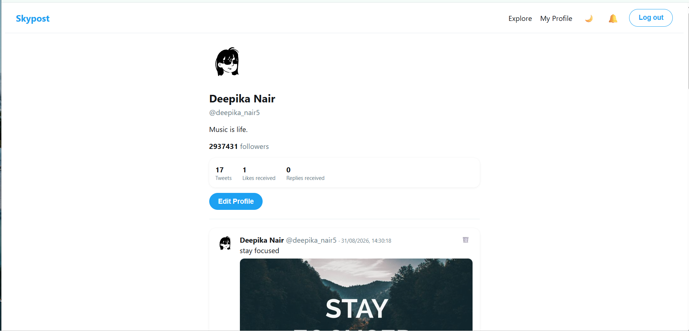
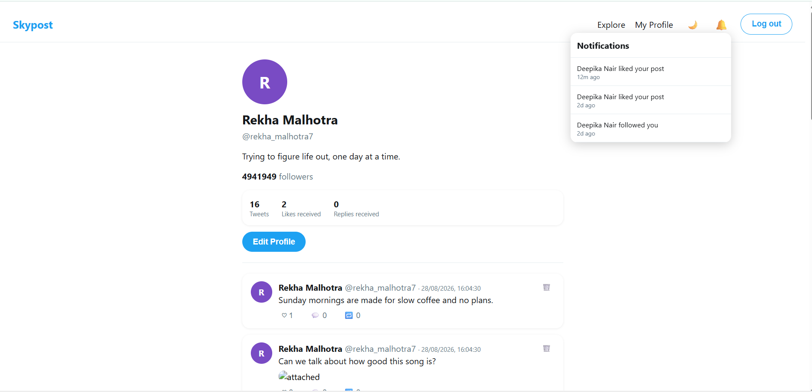

# Skypost

A full-stack, Twitter-style social platform built to demonstrate real
system design concepts: hybrid fan-out timeline generation, ACID-safe
relational data, Redis caching, real-time delivery, and full-text search —
on top of a complete, working social feature set.

## Screenshots

### Login

### Home Feed

### Profile

### Notifications

## Features

- JWT authentication with bcrypt password hashing
- Post tweets (280 chars) with optional image upload
- Follow / Unfollow, with "Who to follow" suggestions
- **Home timeline: hybrid push/pull fan-out model** (the core system design piece — see below)
- Likes, threaded replies, reposts
- Clickable #hashtags and @mentions
- Trending hashtags panel
- **Real-time notifications** via Socket.IO (likes, replies, reposts, follows)
- Block (mutual hide + prevents following) and Mute (silent, one-way hide)
- Soft-delete your own tweets
- Dark mode toggle
- Profile stats: tweets posted, likes received, replies received
- 120 preset avatars, or upload your own photo
- Full-text tweet search with "Load more" cursor pagination

## Tech Stack

| Layer | Technology |
|---|---|
| Frontend | React (Vite), React Router |
| Backend | Node.js, Express |
| Database | PostgreSQL (full-text search via tsvector/GIN index) |
| Cache | Redis |
| Real-time | Socket.IO |
| Media | Cloudinary |
| Auth | JWT + bcrypt |
| Containerization | Docker + Docker Compose |

## System Design Highlights

**Hybrid fan-out timeline** — the core engineering problem this project
solves. When a user posts:
- If they're a regular user (below a follower-count threshold), the tweet
  is immediately pushed (`LPUSH` + `LTRIM`) into every follower's cached
  Redis timeline — fan-out-on-write. Reads are then instant.
- If they're a "celebrity" account (above the threshold), nothing is
  pushed. Instead, their tweets are pulled live from Postgres at read
  time and merged into followers' feeds — fan-out-on-read.

This mirrors the real tradeoff large social platforms make: pushing to
millions of followers on every post doesn't scale, but pulling live for
every read doesn't scale either — so the system routes based on account
size.

**Other notable decisions:**
- Follow/unfollow and like/unlike are wrapped in Postgres transactions so
  denormalized counters (follower_count, like_count) can never drift out
  of sync.
- Tweets are soft-deleted (flagged, not removed), preserving referential
  integrity for likes/replies that point at them.
- Socket.IO shares the same HTTP server/port as the REST API — no extra
  service needed for real-time notification delivery.
- A two-tier auth middleware (`requireAuth` vs `optionalAuth`) lets
  routes like search and profile viewing work for logged-out visitors
  while still personalizing results for logged-in ones.

## Prerequisites

You need these installed before running the project:
- [Docker Desktop](https://www.docker.com/products/docker-desktop) (includes Docker Compose)
- Git

Node.js is **not** required on your machine — everything runs inside Docker containers.

## Getting Started

1. Clone this repo:

git clone https://github.com/nayana888ks/skypost.git
cd skypost/twitter-clone

2. Copy the environment file:

cp backend/.env.example backend/.env

3. **(Optional, for image uploads)** Sign up free at [cloudinary.com](https://cloudinary.com),
   grab your Cloud Name, and create an **unsigned** upload preset under
   Settings → Upload → Upload presets. Then update
   `frontend/src/cloudinary.js` with your values. Without this step,
   everything else still works — only photo uploads will show an error.

4. Build and start everything:

docker-compose up --build -d

5. Confirm all 4 containers are running:

docker-compose ps

6. Seed the database with 150 sample users, tweets, and follow relationships:

docker-compose exec backend npm run seed

7. Open the app: [http://localhost:5173](http://localhost:5173)

## Test Accounts

Every seeded account uses the same password: `password123`

| Email | Notes |
|---|---|
| person0@example.com – person14@example.com | Pre-seeded with sample notifications |
| person15@example.com – person149@example.com | Standard accounts |
| First 32 seeded accounts | "Celebrity" accounts (millions of followers, pulled at read time) |

## Project Structure
backend/
seed.js -- generates 150 users, follows, tweets, notifications
src/
socket.js -- Socket.IO setup, JWT-authenticated per-user rooms
config/ -- Postgres, Redis, schema.sql
middleware/auth.js -- requireAuth + optionalAuth
models/ -- one file per table (user, tweet, follow, notification, block)
controllers/ -- request handlers
routes/ -- URL -> controller mapping
services/ -- fanoutService (write path), timelineService (read path)
frontend/
src/
ThemeContext.jsx -- light/dark mode provider
cloudinary.js -- shared image-upload helper
pages/ -- Login, Signup, Home, Profile, Explore
components/ -- Tweet, ComposeBox, WhoToFollow, TrendingWidget, NotificationBell
theme.js -- colors, card/button styles, avatar presets

## License

This project was built for learning and portfolio purposes.

